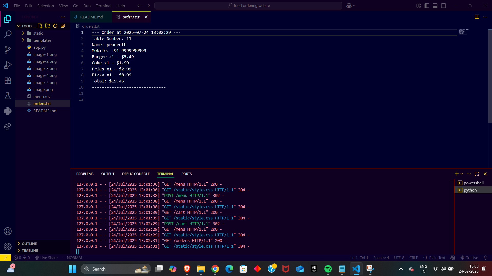

Restaurant Ordering System
A modern restaurant menu, ordering, and invoice system built with Flask, Jinja2, and Bootstrap.
Features user login, table assignment, menu with images, animated cart, rich past-orders invoice view, and a clean, “handmade” design.
Data is loaded from CSV, orders are logged as text, and styles are easily customizable.

🚀 Features
User Login: Name and mobile (with country code) required; friendly validation.

Table Assignment: Enter table number after login.

Menu UI: Food items with pictures, custom colors, and smooth visual design.

Cart: Add/remove items, change quantities, and see cart summary with images.

Order Placement: Orders are timestamped and saved in a plain text file, including itemized invoice.

Past Orders (Invoice): All previous orders shown as printable invoices, with amounts in dollars ($).

Responsive Layout: Looks great on mobile and desktop.

Custom Styles: Easily switch color scheme, backgrounds, fonts (Californian FB if available).

No database required.

📁 Folder Structure
text
restaurant-ordering/
├── static/
│   ├── images/          # Custom image assets (optional)
│   └── style.css        # Global CSS styles
├── templates/
│   ├── base.html
│   ├── login.html
│   ├── table.html
│   ├── menu.html
│   ├── cart.html
│   └── orders.html
├── app.py
├── menu.csv
└── orders.txt
⚙️ How to Run
Clone this repository

text
git clone https://github.com/yourusername/restaurant-ordering.git
cd restaurant-ordering
Install dependencies

text
pip install flask
Check your menu

Edit menu.csv to adjust dishes, prices, or images.

Example row:

text
Pizza,8.99,https://images.unsplash.com/photo-1513104890138-7c749659a591
Run the server

text
python app.py
Open your browser and navigate to

text
http://127.0.0.1:5000
🖼️ Screenshots
| .

orders.txt: Appends every order with user info, timestamp, table, items, and total.

